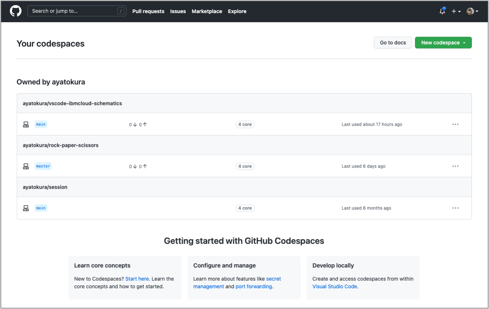

こんにちは。職業「戸倉彩」です。

今回は、GitHubで作成したCodespaceの管理や削除する操作手順について紹介していきます。GitHub公式のドキュメント[codespace を削除する - GitHub Docs](https://docs.github.com/ja/codespaces/developing-in-codespaces/deleting-a-codespace)でも手順が紹介されていますが、画面が一部アップデートされており、筆者は一瞬戸惑ったため記事に残しておこうと思いました。今後も画面やサービス内容は変更される可能性があるため、必要に応じて公式サイトも合わせてご確認ください。
※スクリーンショットは、2021年8月29日現在のものになります。

GitHub Codespaceの概要や作成方法については割愛させていただきます。この操作は、すでにGitHub Codespaceを作成してある状態で、ご自身のCodespaceの管理や、不要になったものを削除したい場合に参考にしていただくための目的で書かれています。ユーザーアカウントごとにcodespaceが無料で作成できる制限数に達した状況で、新しいcodespaceを作成したい場合には、使っていないcodespaceを削除して制限内で使える分を確保する必要があります。

## GitHub Codespaceの管理画面
1. GitHubにログインする
2. [Codespace管理ページ](https://github.com/codespaces)へアクセスする
3. ご自身のCodespaceを作成したリポジトリやブランチ名が表示される

## CodeHub Codespaceを削除する方法
削除する方法は2つあります。上記のCodespace管理ページまたは該当するリポジトリの** [・・・]** メニューから行うことができます。下記では、後者の操作の流れについて記載しておきます。

1. 削除したいGitHub Codespaceを作成したリポジトリを表示する
2. **[< > Code]** ボタンをクリックする
3. **[Manage all]** をクリックする

4. **[Your codespaces]** ページが表示される
5. 削除したいCodespaceリストの右の **[・・・]** をクリックする
6. 表示されたメニューから **[Delete]** をクリックする

7. 削除を行なって良いか確認メッセージ「Are you sure you want to delete codespace?」が表示されるので、**[OK]** ボタンをクリックする

8. 正常に削除が行われるとリストが消える

今回は以上となります。

Twitter [@ayatokura](https://twitter.com/ayatokura) で、最新情報も配信していますので、よろしければフォローも是非お願いします。